# ChefMate

[ChefMate](https://chef-mate2023-79fb9bc80075.herokuapp.com/) is a site for publishing and categorizing recipes, enabling the user to upload their recipes, like other people's recipes, and create recipe categories that they can put recipes in. The application allows all users to view recipes contained in a relational database which holds all of the recipes, which users have authored them,  which users have liked them, and what categories they belong to. The recipe categories also contain information on which user created them, so that each user can view, update, and delete only the categories that belong to them. On the site, the user has the option to like recipes, create new categories, add/remove recipes to/from categories, and also to submit recipes for admin approval. The site also features an admin panel for managing all content in the sites database. Notably, the admin can unpublish and publish recipes through a simple toggle, allowing content shown on the site to be rapidly published or pulled.

## Features 

- __Recipe details__
    - When a recipe card is clicked, the user is redirected to a detailed page for that recipe, with the link generated from a unique slugfield in the recipe's model.
    - This contains the controls and information that exists on the regular recipe card, only with more text content detailing how to make the recipe. 
    - This will be useful to the user as it keeps the detailed information on a recipe on one particular recipe to a unique site location.
    \
    &nbsp;

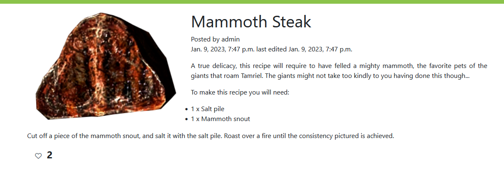

- __Recipe feed__

    - Whether the user is signed in or not, they will be able to view a paginated feed of all recipes that have the published status.
    - These recipes, displayed on cards, contain an image, a title, some text, a button that allows a signed in user to like/unlike, and if the user is signed in, a button to add the recipe to categories.
    - The cards also redirect to pages with more information on the recipes.
    - This paginated feed is also used for other signed-in specific functionalities, such as displaying all recipes the user has liked or displaying all recipes of a specific category.
    - This allows the user to easily parse through recipes.
    \
    &nbsp;

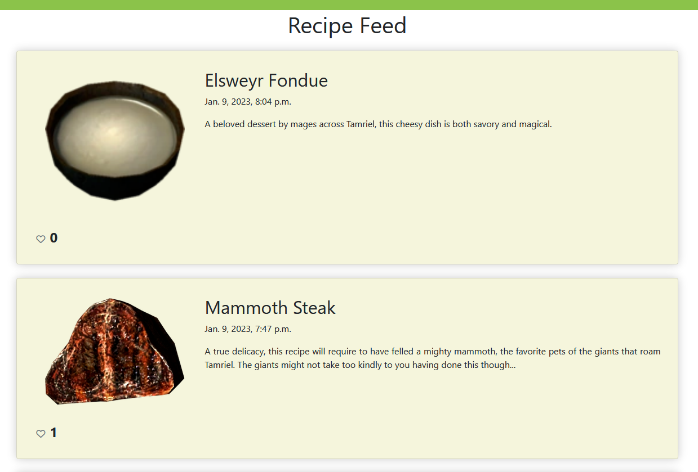

&nbsp;

### Existing Features
- __Creating/accessing user account__

    - On loading the page, in the upper right hand corner of the viewport, the user has controls to login/register.
    - These redirect to respective login/signup pages.
    - The backend uses the django.allauth features to store and retrieve relevant data from interaction with these forms.
    - When the user wishes to log out, they may do so by clicking into the logout control, displayed in the same spot, which only shows if the user is authenticated.
    - These features allow the user to manage their account. 
    \
    &nbsp;

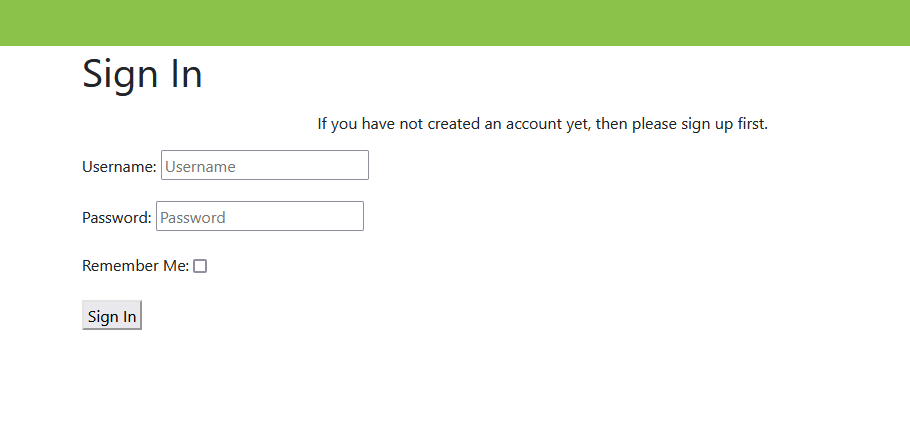
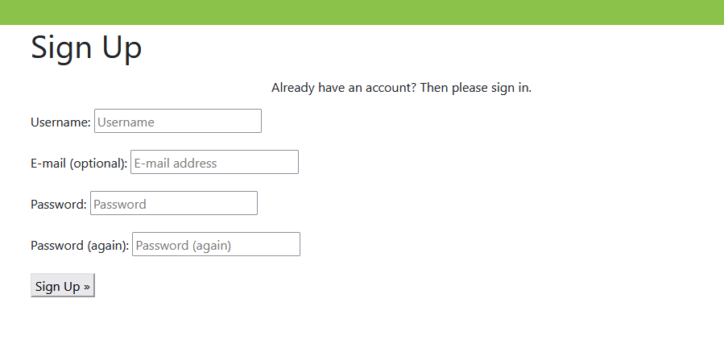

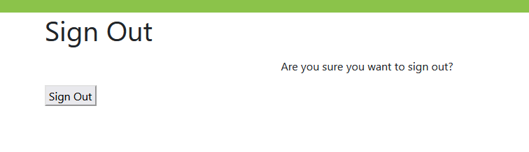

&nbsp;

- __Category sidebar__

    - When the user is signed in, a sidebar displays which anchors to two filters (Liked, and My Submitted Recipes) and anchors to as many categories as the user has.
    - This allows the user to filter recipes by specific criteria, for easier access of recipes they may wish to save for specific purposes.
    - On smaller device sizes, the sidebar is a collapsible. This ensures that the screen space is kept decluttered for easier viewing of the site content.
    - This allows the user to easily access filters and category lists. 
    \
    &nbsp;

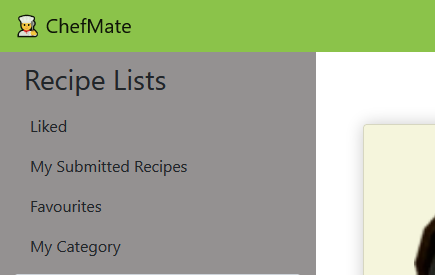
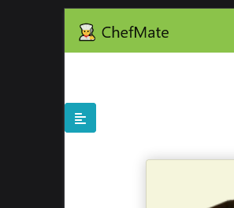
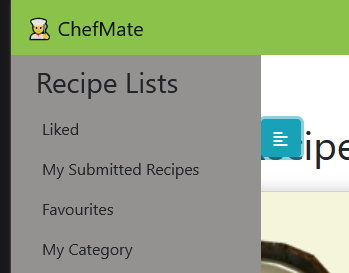

&nbsp;
- __Add/remove category__

    - In the sidebar which only displays when the user is signed in, there is a form that allows the user to input a string, and then hit a button. 
    - This creates a new category associated to the user with its name set as the string the user has input.
    - The new category is subsequently added to the sidebar as the page is refreshed.
    - When clicking into a page for a recipe category, there is a button that allows the user to delete the category, colored to reflect its delete functionality.
    - When clicked, it removes the category from the database, and redirects the user back to home.
    - This allows the user to easily manage the recipe categories they have on their account
    \
    &nbsp;

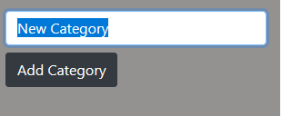

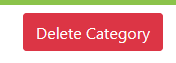

&nbsp;
- __Like/unlike recipe__ 

    - On the recipes cards displayed on each feed, and in recipe pages, there is a button with a universally understood symbol that the user can click. 
    - This button will toggle whether the user is associated with the recipes's like field in the database.
    - The number of likes that a recipe has is also displayed beside this button.
    - This allows the user to easily set preferences, and have an unsorted list of uncategorized recipes to draw from.
    - The user can also easily unlike a recipe, if they wish to no longer have it in their list of liked recipes.
    \
    &nbsp;

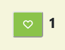
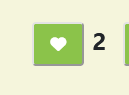

&nbsp;
- __Add/remove recipe to/from category__

    - On each recipe card and on each recipe page, there is a button of a folder icon.
    - Clicking this opens a dropdown list of buttons of the user's categories.
    - When a category button is clicked, the recipe is added to that category in the database and displays in the paginated feed when that category is selected from the sidebar.
    - In the paginated display for the recipes added to a category, there is a a button that says remove, and is color-coded to represent its delete functionality.
    - This removes the recipe from the category in the database and causes it to no longer display when filtering by the category.
    - This allows the user to easily categorise recipes as they navigate the site and manage the categories they have.
    \
    &nbsp;

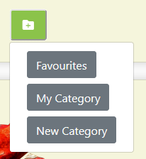
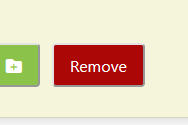

&nbsp;
- __Submit new recipe__ 

    - On the home page, when the user is signed in, a button displays which redirects to a form page.
    - This form allows the user to input data regarding a recipe (title, image, text)
    - On submission, a recipe is a added to the database, which is set to unpublished. This allows the site admin to vet user-submitted content. 
    - The user can also view both unpublished and published recipes authored by them by clicking on the "My Submitted Recipes" anchor in the sidebar.
    - This will allow the user to add their own recipes, and also to rapidly source content from the site by generating it from users.
    \
    &nbsp;

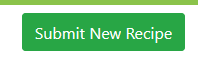
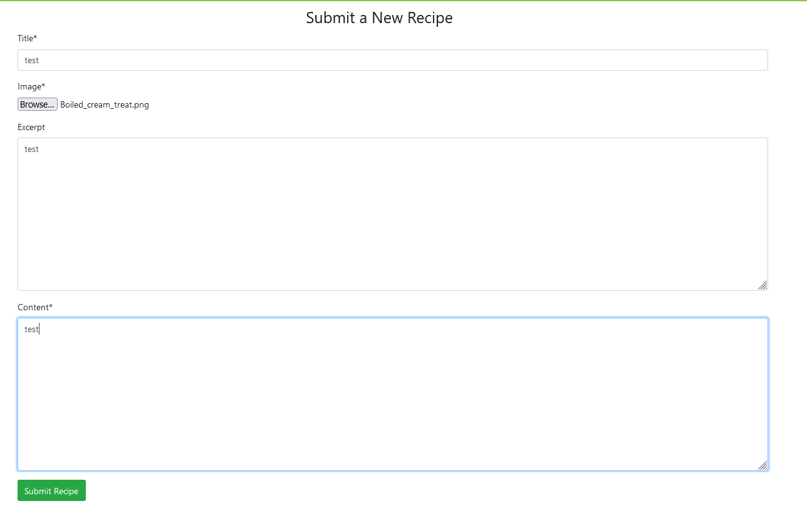
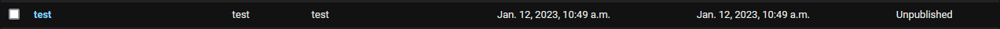

&nbsp;
- __Admin panel__

    - The admin panel contains full CRUD functionality for each table in the project's database.
    - It also has the a number of tools for searching and filtering data in each table. 
    - An example of such an interface is shown below.
    - This interface allows a site admin to easily manage the content on their website, without the requirement for an in-depth knowledge of the server-side architecture.
    \
    &nbsp;

&nbsp;
### Features Left to Implement

&nbsp;

***Site Messages***
Overall when interacting with the site there is a lack of site messages. Much of this is to do with how the various views are structured, ie. the views for displaying data are largely kept seperate from those posting data. As such, messages that would display on a post request are not seen by the user, as they are usually redirected away from the posted to URL immediately. This can make it hard to confirm that things have happened in the backend, such as a recipe being submitted. Some method of injecting context from posts to their redirected locations would be needed.

&nbsp;

***Edit Recipe***
A functionality that was considered as a user story was the ability for a user to edit the recipes they had submitted. A way of doing this would be to have the recipe detail page have context injected into it showing whether the recipe was authored by the user, and if so a button to edit the recipe would display. Then, a similar form to the one for submitting a recipe, prepopulated with the existing recipe data, would be displayed to the user. On submitting the recipe would be reverted to being unpublished, allowing the site admin to vet any changes.

&nbsp;

***Back button***
A functionality that became obviously needed in the interface was one that allowed the user to go back without resorting to the browsers back button, the site's side bar or the site's logo. Considering how this would be done however was not as straightforward at my current understanding of django. How to inject context from the view such that the user can go back to the previous URL did not seem a straightforward process, as already complicated control statements and embedding of data in URLs had been needed to allow the site's post views requests to redirect to the page the user had been on.

&nbsp;

***Scroll point/pagination maintained after action***
One issue that still exists with the various views that post data for the user is that however far they are scrolled on a page or what page in a paginated list they are on is not maintained. This can be jarring in certain cases, such as liking past the 2nd page of the feed. Likely this would require the use of javascript and event listeners to parse where the user is at in a page before calling a post view.

&nbsp;

***Recipe Tags/More information-rich recipes***
Another feature considered was the ability to add custom tags to recipes (eg. lunch, dessert), which would display on cards and in recipe detail pages. As well, content within the recipes could be further subdivided (eg. content be broken up into ingredients and steps). However, this would have required a much more complicated database schema than was feasible to implement

&nbsp;

***Better account management***
Finally, it was considered that the user should be better able to manage their account (eg. recover their password). However this would have required more familiarity with the django.all_auth module than I currently have, along with some work, such as automated email systems, that might go beyond the scope of this project. 

&nbsp;

## Testing 
### Recipe Cards
- The following table goes through every action on each part of the recipe cards, listing the expected behavior and what actually occurs. 

|Action               |Expected Behavior                                 |What Occurs                            |Working as intended?   |
|:------------------------|:-------------------------------------------------|:--------------------------------------|:---------------------:|
|Click on recipe card |Opens detailed view of recipe|Opens detailed view of recipe|✔                     |
|Like/unlike recipe |Toggles like/unlike |Toggles like/unlike|✔                     |
|Like/unlike recipe |Toggles like/unlike |Toggles like/unlike|✔                     |
|Add recipe to category |Adds recipe to category |Adds recipe to category |✔                     |
\
&nbsp;
### Account functionality
- The following table goes through each part of the account management functionalities, listing the expected behavior and what actually occurs. 

|Action               |Expected Behavior                                 |What Occurs                            |Working as intended?   |
|:------------------------|:-------------------------------------------------|:--------------------------------------|:---------------------:|
|Sign in with valid credentials  |Redirect to home page with authenticated user controls displaying |Redirect to home page with authenticated user controls displaying|✔                     |
|Sign in with invalid credentials |Form tells user to reenter details|Form tells user to reenter details|✔                     |
|Signup|Redirect to home page with authenticated user controls displaying, new user shows in admin panel|Redirect to home page with authenticated user controls displaying, new user shows in admin panel|✔                     |
|Logout|Redirect to home page without authenticated user controls displaying|Redirect to home page without authenticated user controls displaying|✔                     |
\
&nbsp;
### Add Category
- The following table goes through each possible action on the add category form in the sidebar, listing the expected behavior and what actually occurs. 

|Action               |Expected Behavior                                 |What Occurs                            |Working as intended?   |
|:------------------------|:-------------------------------------------------|:--------------------------------------|:---------------------:|
|Enter empty text         |No change, no category added|No change, no category added|✔                     |
|Enter text |A category is added with name set to the text inputted|A category is added with name set to the text inputted|✔                     |

\
&nbsp;

#### Submit Recipe
- The following table goes through each possible action involving the submit recipe interface, listing expected behavior and what actually occurs.

|Action          |Expected Behavior     |What Occurs             |Working as intended?   |
|:------------------|:---------------------|:-----------------------|:---------------------:|
|Submit form without required fields|Form informs user to fill out required fields|Form informs user to fill out required fields|✔                     |
|Submit form filled out|User redirected to empty form, form data appears as an unpublished recipe in the admin panel|User redirected to empty form, form data appears as an unpublished recipe in the admin panel|✔                     |

\
&nbsp;

### Bugs 

    - It is possible to add as many categories of the same name as you want. While this would not be useful to a normal user and they would probably only do this accidentally, it can make the UI look ugly if it happens as the same name is repeated
    - The paginator in  django.view.generic.ListView seems to not reset itself between instances of the view. This made pagination appear where it does not exist, creating unintended problems in the UI (eg. the user seeing the message for an empty category if they clicked on the next page.). A workaround that manually sets the number of pages has been used, but the paginator will still exist where it's unneeded and cause the pagination controls to still display in lists that are shorter than the length of the list. 
    - Not a lot of defensive programming was made to validate user inputted values. It could be possible to break the urls with certain permutations of values stored in the database.

&nbsp;
### Database Schema
    - The following diagram representing the database schema was made with [dbdiagram](https://dbdiagram.io):

    \
    &nbsp;
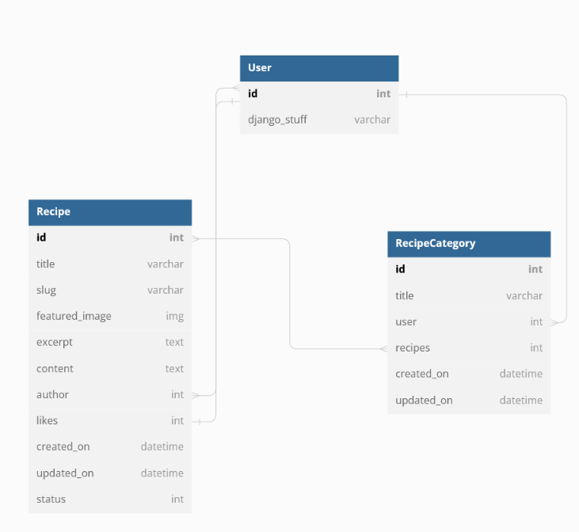

&nbsp;

&nbsp;
### Libraries 

    - Django was used to created this project, as well as numerous add-ons to this frameworks, such as summernote, for making user-friendly forms in the admin panel, and cloudinary, for accessing the cloudinary server that hosts the static files and images for this project.

&nbsp;
### Unfixed Bugs

    - Issue with unnecessary pagination
    - Many permutations of the website's state untested and could break badly

&nbsp;
## Deployment

- This project was deployed using [heroku](https://heroku.com), using the following steps:

- In the workspace:
    - before any commits were made, "env.py" was added to .gitignore
    - SECRET_KEY was hidden in env.py
    - run "pip3 freeze > requirements.txt"

- On heroku:
    - On the dashboard "New">"Create new app"
    - Entered "chef-mate" for the app name, selected "Europe" as the region
    - Clicked "Create app"
    - In "Settings">"Reveal Config Vars" entered 4 creds
    - CLOUDINARY_URL - *the URL for the cloudinary database*
    - DATABASE_URL - *the URL for the ElephantSQL database*
    - PORT - 8000 
    - SECRET_KEY - *the secret key for the project*
    - In "Deploy">"Deployment Method" selected Github
    - Entered "chef-mate" into repo name field
    - Ensured main was the branch selected to deploy, and then clicked "Enable Automatic Deploys" to sync with git pushes

&nbsp;

- For local deployment, run the following command:

      git clone https://github.com/ocassidydev/chef-mate.git

&nbsp;
## Credits 

### Code
-  The [django documentation](https://docs.djangoproject.com/en/4.1/) was useful in providing an easy reference point for the many classes and methods needed to be customized in the views. 
- The [bootstrap documentation](https://getbootstrap.com/docs/4.0/getting-started/introduction/) was useful in giving different useful elements to include in the site and instruction on how to use the in-built classes for responsivity.
- The [bootstrapious](https://bootstrapious.com/p/bootstrap-sidebar) had a tutorial on how to create the collapsible sidebar I use on smaller mobile sizes
&nbsp;
